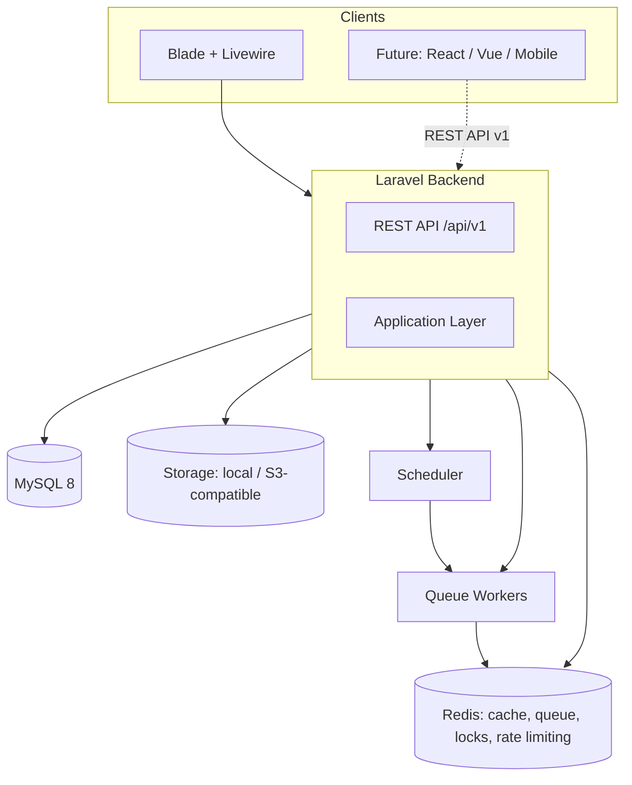
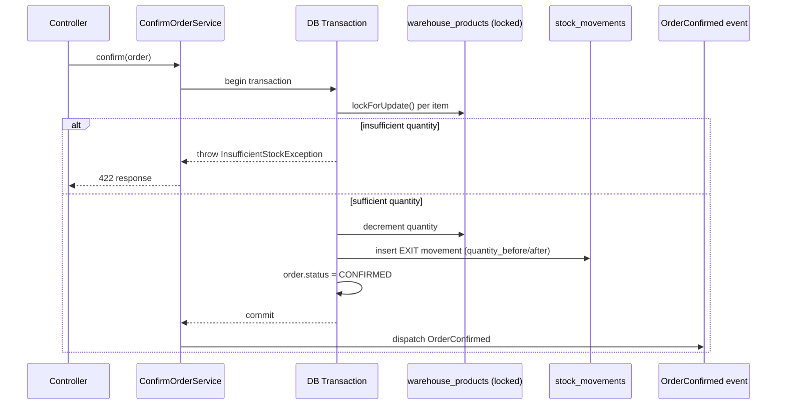
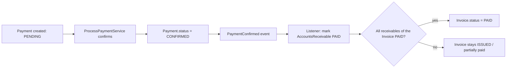
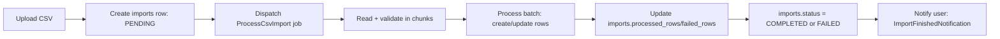
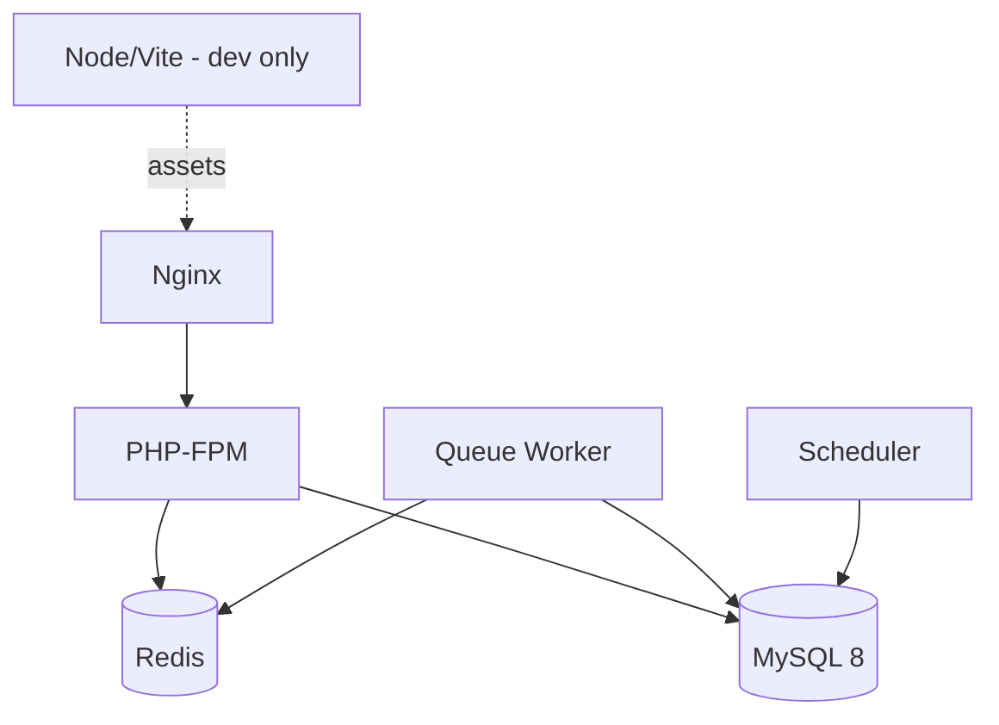

# Architecture

EnterpriseHub is a multi-tenant business management platform (customers,
products, stock, orders, invoicing, receivables/payables) built as a Laravel
laboratory: the functional system is the vehicle, the goal is a portfolio-grade
demonstration of Laravel's own toolbox — queues, events, observers,
notifications, caching, Sanctum, testing, observability — used *because they
solve a real problem in this domain*, not bolted on for their own sake.

This is Phase 1 of the roadmap (architecture only — see [§ 24 Roadmap](#24-roadmap)).
No application code exists yet; this document and [database.md](database.md)
are what the rest of the project is built against.

## Table of contents

- [1. System overview](#1-system-overview)
- [2. Modules](#2-modules)
- [8. Multi-tenancy strategy](#8-multi-tenancy-strategy)
- [12. Audit strategy](#12-audit-strategy)
- [13. Authentication strategy](#13-authentication-strategy)
- [14. Authorization strategy](#14-authorization-strategy)
- [15. Folder structure](#15-folder-structure)
- [16. Process flows](#16-process-flows)
- [17. Queue architecture](#17-queue-architecture)
- [18. Event architecture](#18-event-architecture)
- [19. Cache architecture](#19-cache-architecture)
- [20. Storage architecture](#20-storage-architecture)
- [21. API architecture](#21-api-architecture)
- [22. Testing strategy](#22-testing-strategy)
- [23. Docker architecture](#23-docker-architecture)
- [24. Roadmap](#24-roadmap)
- [Architectural decisions](#architectural-decisions)

---

## 1. System overview



A single Laravel monolith serves both server-rendered Blade/Livewire pages
and a versioned REST API. The API is not an afterthought bolted onto the web
app — every write path goes through the same Service layer regardless of
entry point, so the API is a first-class client from day one, in preparation
for a future SPA/mobile client without a rewrite.

## 2. Modules

| Module | Responsibility |
|---|---|
| Authentication | login, logout, password reset, email verification, Sanctum tokens |
| Companies (tenancy) | company CRUD, the isolation boundary for everything else |
| Users & RBAC | user CRUD, roles, permissions, policies |
| Departments & Employees | internal org structure, optionally linked to a `User` |
| Customers | customer CRUD, addresses |
| Catalog | categories, products, price lists |
| Stock | warehouses, per-warehouse quantities, movement ledger |
| Orders | draft-to-delivered lifecycle, stock consumption |
| Finance | invoices, accounts receivable/payable, payments |
| Files | polymorphic attachments, async processing |
| Audit | change history across all tenant models |
| Notifications | database + mail, low-stock/overdue/order/payment alerts |
| Imports/Exports | CSV import pipeline, CSV/XLSX/PDF/JSON export |
| Reports | sales, stock, financial, customer, employee |
| Webhooks | outbound event delivery to external URLs |
| API | `/api/v1`, resources, filtering, pagination, rate limiting |

## 8. Multi-tenancy strategy

**Model: shared database, shared schema, discriminator column.** Every
tenant-owned table carries `company_id`. This is a deliberate choice over
database-per-tenant or schema-per-tenant:

> **Problem** — isolate Company A's data from Company B's without allowing a
> query to leak across the boundary.
> **Alternatives** — (a) one database per company, (b) one schema per
> company, (c) shared schema with a `company_id` column.
> **Choice** — (c).
> **Reason** — this is a portfolio/lab project at a scale where per-tenant
> provisioning (migrations x N databases, connection pooling per tenant,
> cross-tenant reporting complexity) would be pure overhead with no
> corresponding benefit. (c) is also what the vast majority of real-world
> Laravel SaaS products actually run in production at small-to-mid scale.
> **Trade-offs** — a single bug in the isolation logic is more dangerous
> (all tenants share physical storage) than in a database-per-tenant setup,
> so isolation is enforced at **three independent layers**, not one, to make
> that failure mode as unlikely as reasonably possible:

1. **Global Scope** — a `CompanyScope` applied via a `BelongsToCompany` trait
   on every tenant Eloquent model. It adds `WHERE company_id = ?` to every
   query automatically and sets `company_id` on create. This is the
   day-to-day safety net — a developer who forgets to scope a query is
   protected anyway.
2. **Route Model Binding + Policy** — every Policy's `view`/`update`/`delete`
   methods check `$model->company_id === $user->company_id` explicitly, so
   isolation does not depend *only* on the global scope being active (e.g. a
   deliberate `withoutGlobalScope()` call for an admin report does not
   accidentally leak into an authorization decision).
3. **Middleware** — `EnsureUserBelongsToActiveCompany` runs on every
   authenticated route, rejecting requests from users whose company is
   `suspended`/`inactive` before any controller code runs.

`company_id` is a **direct column on every tenant table**, including
join/detail tables like `order_items` and `customer_addresses`, rather than
being derived transitively through a parent relationship. This is redundant
data by strict normalization rules, but it means the global scope and every
index in [database.md § indexes](database.md#4-indexes) can filter by
`company_id` directly with no join — both simpler code and a materially
cheaper query plan than resolving tenancy through 2-3 joins on every request.

No cross-company "super admin" role is included — it was not part of the
brief, and inventing platform-wide access would be a second, harder
isolation boundary to get right for no stated requirement. Flagged here as a
**candidate future addition**, not built silently.

## 12. Audit strategy

An `AuditableObserver` (registered once, applied to every model that uses
the `Auditable` trait — all tenant models) writes to `audit_logs` on
`created`, `updated`, and `deleted`. It captures `getDirty()`/`getOriginal()`
as `old_values`/`new_values`, the authenticated user, IP, and user agent.

This is an **Observer**, not an **Event**, deliberately — see
[Observer vs Event vs Job](#observer-vs-event-vs-job) below. Auditing is a
direct, synchronous reaction to a model changing state; it is not something
other parts of the system need to react to, so it does not need the
decoupling an Event provides.

`audit_logs` is append-only: no `updated_at`, no soft deletes on the log
itself — a log that can be edited is not a log.

## 13. Authentication strategy

| Surface | Mechanism |
|---|---|
| Web (Blade/Livewire) | session-based, Laravel's built-in guard, login/logout/password-reset/email-verification |
| API (`/api/v1`) | Laravel Sanctum personal access tokens |

A user always belongs to exactly one company (`users.company_id`,
non-nullable). `users.email` is **globally** unique rather than unique
*per company* — chosen so `Auth::attempt(['email' => ..., 'password' => ...])`
resolves a user without first asking "which company?", keeping login a
single step. The trade-off, made explicit rather than silently assumed: the
same person cannot hold two separate accounts (one per company) under the
same email address in this design. Flagged as a scope decision, not an
oversight.

Sanctum tokens are scoped with abilities matching the permission names in
[database.md § roles/permissions](database.md#roles--permissions--role_user--permission_role)
(e.g. a token can be minted with only `orders.view, orders.create`), so a
third-party integration can be issued a narrower token than the user's full
role would allow.

## 14. Authorization strategy

Two layers, each with a distinct job:

- **Policies** — per-model, ownership + tenancy checks
  (`$model->company_id === $user->company_id`) plus a permission check
  delegated to the RBAC tables (`$user->hasPermission('orders.update')`).
  Every model with a Controller has a matching Policy; policies are the
  **only** place authorization logic lives — never duplicated in a
  controller or Blade view.
- **Gate::before** — a single global hook resolves `ADMIN`-role users as
  authorized for everything within their own company, so individual
  policies do not need an `if ($user->isAdmin()) return true;` line
  repeated in every method.

RBAC (`roles`, `permissions`, `role_user`, `permission_role`) is **global**,
not per-company:

> **Problem** — should "ADMIN", "SALES", etc. be distinct rows per company,
> or shared definitions?
> **Alternatives** — (a) clone the 6 roles and ~20 permissions into every
> company at creation time, (b) one global catalog, referenced by every
> company's users.
> **Choice** — (b).
> **Reason** — the permission set (`orders.view`, `finance.manage`, ...) is
> identical across every company in this system; per-company rows would be
> the same data duplicated N times with no per-company customization
> actually required by the brief. `role_user` already scopes *who* holds a
> role; the role definition itself does not need to be tenant-scoped.
> **Trade-offs** — if a future requirement needs company-specific custom
> roles (e.g. Company A wants a "WAREHOUSE_LEAD" role that doesn't exist
> elsewhere), this model does not support that without a follow-up
> migration. Not built for now because it is not a stated requirement.

Middleware (`EnsureUserBelongsToActiveCompany`, `EnsurePermission:orders.view`
as a parametrized middleware alias) guards route *access*; Policies guard
*object-level* authorization once a specific model is loaded. Both are used
together, not as substitutes for each other.

## 15. Folder structure

```text
app/
├── Actions/            # single-purpose, reused across multiple entry points
├── Console/Commands/    # enterprise:install, reports:generate, etc.
├── Contracts/           # Repository interfaces, external service interfaces
├── DTOs/                # typed data crossing Controller -> Service
├── Enums/                # UserStatus, OrderStatus, StockMovementType, ...
├── Events/
├── Exceptions/
├── Http/
│   ├── Controllers/
│   │   ├── Api/V1/
│   │   └── Web/
│   ├── Middleware/
│   ├── Requests/
│   └── Resources/
├── Jobs/
├── Listeners/
├── Mail/
├── Models/
├── Notifications/
├── Observers/
├── Policies/
├── Repositories/         # only where §Repositories below justifies one
├── Services/
└── Support/              # small framework-agnostic helpers (e.g. money formatting)
```

No `app/Traits`, `app/Helpers`, or `app/Interfaces` catch-all directories —
traits live next to what they support (`Models/Concerns/BelongsToCompany.php`),
and interfaces live in `Contracts/` grouped by what they abstract.

## 16. Process flows

### Order confirmation (stock-critical path)



Why this is transactional and locked — see
[Transactions](#transactions) and [lockForUpdate()](#lockforupdate).

### Payment → invoice settlement



### CSV import



Processed in chunks (`LazyCollection`/`chunk()`) rather than loading the
whole file into memory — see [§ 19 Cache](#19-cache-architecture) note on
`Lazy Collections` and [database.md § imports](database.md#imports).

### Invoice PDF generation

```text
Invoice issued
  -> GenerateInvoicePdf job queued (queue: exports)
  -> job eager-loads invoice.items, invoice.customer (avoids N+1)
  -> renders PDF, stores on disk, sets invoices.pdf_path
  -> dispatches SendInvoiceEmail job (chained)
```

## 17. Queue architecture

Redis is the queue backend.

> **Why Redis for queues?** Database-backed queues (`QUEUE_CONNECTION=database`)
> poll the `jobs` table, adding write load to the primary datastore under
> exactly the traffic pattern (bursty background work) where that hurts
> most. Redis is already required for cache/locks/rate limiting in this
> project, so it is zero additional infrastructure, and it is what Horizon
> is built for.

| Queue | Used by | Priority |
|---|---|---|
| `default` | order/stock/audit-adjacent jobs | high |
| `notifications` | `SendOrderNotification`, `SendPaymentReminder`, mail jobs | medium |
| `exports` | `GenerateInvoicePdf`, `GenerateMonthlyReport`, CSV/XLSX export | low |
| `imports` | `ProcessCsvImport`, `ProcessUploadedFile` | low |
| `webhooks` | outbound webhook delivery | medium |

Horizon is configured with the `default` and `notifications` queues at
higher worker weight than `exports`/`imports`, so a large report generation
never starves order-confirmation notifications.

| Job | Retry | Backoff | Notes |
|---|---|---|---|
| `GenerateInvoicePdf` | 3 | 10s, 30s, 60s | chained → `SendInvoiceEmail` |
| `SendInvoiceEmail` | 5 | exponential | mail transport is the least reliable dependency |
| `ProcessCsvImport` | 1 (no auto-retry) | — | a failed batch is reported to the user via `imports.status = FAILED`, not silently retried against possibly-already-partially-applied data |
| `ProcessUploadedFile` | 3 | 15s, 60s, 300s | large-file processing (virus scan/thumbnailing placeholder) |
| `GenerateMonthlyReport` | 2 | 60s | scheduled, batched per company |
| `SendPaymentReminder` | 3 | 30s | `ShouldBeUnique` per receivable+day, prevents duplicate reminder sends if the scheduler overlaps a slow run |
| webhook delivery | 5 | exponential, capped at 1h | matches typical webhook-consumer expectations |

Failed jobs land in `failed_jobs` (Horizon UI + `php artisan queue:failed`)
rather than being silently dropped.

## 18. Event architecture

| Event | Listener(s) | Queued? |
|---|---|---|
| `OrderCreated` | `SendOrderNotification` | yes |
| `OrderConfirmed` | `UpdateStock`\*, `CreateAuditLog`\*, `SendOrderEmail` | `SendOrderEmail` yes, others sync (see note) |
| `OrderCancelled` | `ReleaseReservedStock`, `SendOrderNotification` | yes |
| `OrderShipped` | `SendOrderNotification` | yes |
| `OrderDelivered` | `SendOrderNotification` | yes |
| `PaymentCreated` | `NotifyFinanceTeam` | yes |
| `PaymentConfirmed` | `MarkReceivableOrPayablePaid`, `NotifyCustomer` | sync for the state change, queued for notification |
| `PaymentCancelled` | `RevertReceivableStatus` | sync |
| `InvoiceOverdue` | `SendPaymentReminder`, `InvoiceOverdueNotification` | yes |

\* `UpdateStock` and `CreateAuditLog` are listed here for completeness
against the brief's suggested listener names, but in the actual design
**stock update happens inside `ConfirmOrderService`'s transaction** (see
[§16 flow](#order-confirmation-stock-critical-path)), not in an event
listener — stock decrement must succeed-or-fail atomically with the order
confirmation itself, and a queued (or even synchronous but decoupled)
listener cannot participate in that transaction safely. Firing
`OrderConfirmed` *after* the transaction commits, for listeners that react
to the fact it happened (notifications, webhooks), is correct; using an
event to *cause* the stock change would not be. Audit logging is likewise
handled by the `AuditableObserver` (§12), not a listener — see
[Observer vs Event vs Job](#observer-vs-event-vs-job).

## 19. Cache architecture

| Cached | Key | TTL | Invalidation | Why |
|---|---|---|---|---|
| Product categories (per company) | `company:{id}:categories` | 1h | `ProductCategoryObserver` flushes on save/delete | read on every product create/edit form, rarely changes |
| Effective permission set per user | `user:{id}:permissions` | 30 min | flushed in `RoleUser`/`PermissionRole` observers | checked on every authorized request; recomputing the role→permission join every request is wasted work for data that changes rarely |
| Dashboard statistics | `company:{id}:dashboard:{date}` | 15 min | time-based only (accepted staleness) | expensive aggregate queries (order counts, revenue sums); a dashboard does not need to-the-second accuracy |
| Company settings | `company:{id}:settings` | 1h | `CompanyObserver` flushes on save | read on nearly every request (feature flags, locale, currency format) |

Explicitly **not** cached: customer/order/product listing queries — these
are paginated, filtered, and change too often for a cache to pay for
itself; correctness (seeing your own just-created order immediately)
matters more here than shaving a query. Caching is applied where the brief
in §25 asks for it to be justified, not by default.

Redis is also used, independently of `Cache::remember()`, for:

- **Locks** — `Cache::lock('stock:{warehouse_id}:{product_id}')` as a
  secondary guard alongside `lockForUpdate()` for cross-process coordination
  where a DB row lock alone is insufficient (e.g. two queue workers).
- **Rate limiting** — Laravel's rate limiter, backed by Redis, per §29.

## 20. Storage architecture

| Environment | Disk | Notes |
|---|---|---|
| Local dev | `local` (`storage/app`) | fast iteration, no external dependency |
| Docker/staging/prod | `s3` (MinIO in Docker, real S3-compatible bucket in prod) | same driver interface, config-only swap |

Path convention: `{disk}/company-{company_id}/{fileable_type}/{fileable_id}/{filename}`
— keeps tenant data physically separated within the bucket even though the
bucket itself is shared, mirroring the DB isolation strategy in §8.

Small files (avatar-sized) are stored synchronously in the request. Files
above a size threshold (configurable, default 5MB) go through
`UploadFileJob` → `files.status = PENDING` → `ProcessFileJob` performs any
post-processing (e.g. a virus-scan placeholder, thumbnail generation for
images) → `files.status = PROCESSED`, so a large upload never blocks the
HTTP response.

## 21. API architecture

- **Versioning**: `/api/v1/...`, namespace `App\Http\Controllers\Api\V1`.
  A `v2` would be a parallel namespace, not a breaking change to `v1`.
- **Auth**: Sanctum bearer tokens, scoped by ability (§13).
- **Response envelope** (mandatory on every endpoint, success and error):

```json
{
  "success": true,
  "message": "Operation completed successfully.",
  "data": {},
  "meta": {}
}
```

```json
{
  "success": false,
  "message": "Validation failed.",
  "errors": {}
}
```

Enforced by a base `ApiController` + a `Handler::render()` override for
exceptions, so no individual controller can accidentally return a
differently-shaped response.

- **Pagination**: cursor pagination (`cursorPaginate()`) on high-volume
  endpoints (`orders`, `stock_movements`, `audit_logs`); offset pagination
  (`paginate()`) elsewhere where "jump to page 5" UX matters more than
  large-offset query cost.
- **Filtering/sorting/searching**: query string convention
  `?filter[status]=active&sort=-created_at&search=acme`, implemented via a
  small `QueryBuilder` support class (not a package) wrapping Eloquent —
  documented in full once implemented in Phase 7.
- **Rate limiting** (§29):

| Context | Limit |
|---|---|
| Login | 5 attempts / minute / IP |
| Authenticated API | 60 requests / minute / token |
| Public endpoints (none planned by default; documented if added) | 30 / minute / IP |
| Webhooks (outbound delivery, not inbound) | governed by retry/backoff in §17, not a rate limiter |
| Reports (generation endpoints) | 10 / minute / user — report generation is expensive |

## 22. Testing strategy

Pest (Laravel's current default test runner) for both Feature and Unit
tests. Priorities per §34 of the brief — behavioral tests over coverage
percentage:

| Layer | Tool | Example |
|---|---|---|
| Unit | Pest, no DB | Enum transitions (`OrderStatus::DRAFT->canTransitionTo(...)`), DTO construction |
| Feature/HTTP | Pest + `RefreshDatabase` | "User cannot access another company's customer", "Cancelled order cannot be delivered" |
| Queue | `Queue::fake()` | "Confirming an order dispatches OrderConfirmed", "Failed CSV import does not retry silently" |
| Event | `Event::fake()` | listener-to-event wiring, without executing side effects |
| Notification | `Notification::fake()` | "Low stock triggers LowStockNotification" |
| Mail | `Mail::fake()` | invoice email content/recipients |
| API | Pest + Sanctum `actingAs` | full request/response including the envelope shape |
| Multi-tenancy | Feature | the single most important test category — every module gets at least one cross-tenant-leak test |

Test database: a dedicated MySQL test database (not SQLite in-memory) — the
schema uses MySQL-specific behavior (`decimal` precision, composite unique
constraints) that SQLite does not enforce identically, and a divergence
there would be exactly the kind of bug this project exists to avoid.

## 23. Docker architecture



| Service | Image basis | Notes |
|---|---|---|
| `nginx` | `nginx:alpine` | reverse proxy to PHP-FPM |
| `php` | custom, `php:8.3-fpm` based | app runtime |
| `mysql` | `mysql:8` | primary datastore |
| `redis` | `redis:alpine` | cache, queue, locks, rate limiting |
| `queue` | same image as `php`, different command (`queue:work`) | separate container so it scales independently of the web tier |
| `scheduler` | same image as `php`, running `schedule:work` | one instance only (no horizontal scaling — cron-like) |
| `node` | `node:lts`, dev-only | Vite dev server / asset build |

`docker compose up -d` brings up the full stack. Queue workers use the same
application image as the web container (not a separate Dockerfile) — one
image to build and version, differing only in the container command,
consistent with §51's guidance to only split images "when appropriate"
rather than by default.

## 24. Roadmap

| Phase | Scope | Status |
|---|---|---|
| 1 | Architecture (this document + database.md) | ✅ done — awaiting approval to proceed |
| 2 | Infrastructure: Docker, Laravel install, MySQL, Redis, Nginx, queue, scheduler | planned |
| 3 | Core: Users, Companies, Roles, Permissions, Authentication, Authorization | planned |
| 4 | Business: Customers, Products, Stock, Orders | planned |
| 5 | Finance: Invoices, Payments, Receivables, Payables | planned |
| 6 | Advanced Laravel: Events, Listeners, Observers, Jobs, Queues, Notifications, Mail, Cache, Storage | planned |
| 7 | API: Sanctum, Resources, Versioning, Rate limiting, Filtering, Pagination | planned |
| 8 | Reports: PDF, Excel, CSV, background processing | planned |
| 9 | Testing: Unit, Feature, Integration, API, Queue, Event | planned |
| 10 | Production: Performance, Logging, Telescope, Pulse, Horizon, CI/CD, Security | planned |

Each phase only starts once the previous one is confirmed working — no
phase is declared done without passing tests and a working demo of its
slice of the system (per the project's incremental-build convention).

---

## Architectural decisions

Format: Problem → Alternatives → Choice → Reason → Trade-offs, per §57 of
the brief.

### Repositories

> **Problem** — should every model get a Repository, per the classic
> "Controller → Service → Repository → Eloquent" diagram?
> **Alternatives** — (a) a Repository for every model, (b) no repositories,
> Eloquent used directly everywhere, (c) repositories only where they earn
> their cost.
> **Choice** — (c): `CustomerRepository`, `OrderRepository`,
> `ProductRepository`, `ReportRepository` only.
> **Reason** — a Repository is justified when a model has genuinely complex,
> reused query logic (multi-filter search, report aggregation spanning
> several tables) that benefits from a name and a single tested location —
> `ReportRepository::salesByPeriod(...)` is meaningfully clearer than
> rebuilding that query inline in three places. A `DepartmentRepository`
> wrapping `Department::where(...)->get()` would just be Eloquent with
> extra steps.
> **Trade-offs** — an inconsistent-looking codebase (some models have a
> Repository, most don't) — accepted deliberately; consistency for its own
> sake is not a goal here, see [§59 anti-overengineering rule](#).

### Services vs. Actions

> **Problem** — the brief lists both `Services` (§41) and `Actions` (§44)
> for overlapping-sounding responsibilities.
> **Alternatives** — (a) Services only, (b) Actions only, (c) both, with a
> clear boundary.
> **Choice** — (c). **Service** = orchestrates a multi-step business
> process with multiple collaborators (`ConfirmOrderService` coordinates
> the stock lock, the movement ledger, the status transition, and the
> event dispatch). **Action** = a single, narrow, reusable unit invoked
> from more than one entry point — e.g. `TransferStockAction` is called
> from a Controller, from `stock:check` command context, and potentially
> from a future bulk-transfer Job; wrapping it in a full Service class
> for one operation would be ceremony without benefit.
> **Reason** — matches the brief's own framing (§44) instead of picking one
> and ignoring the other.
> **Trade-offs** — requires judgment call per operation; documented here so
> that judgment is consistent rather than ad hoc.

### Observer vs. Event vs. Job

> **Problem** — three mechanisms can all "do something when X happens" —
> when does each apply?
> **Choice/Reason** (§45's framing, made concrete):
> - **Observer** = direct, synchronous reaction to a *Model* changing state,
>   where the reaction is intrinsic to that model (audit logging on every
>   auditable model; recalculating `warehouse_products.quantity`'s cache
>   consistency — though that specific case is handled inside a Service
>   transaction, see below).
> - **Event** = decoupling — "something happened" broadcast to parts of the
>   system that don't need to know about each other (`OrderConfirmed` →
>   notification + webhook delivery, neither of which the order-confirmation
>   code needs to know exists).
> - **Job** = asynchronous or heavy work, regardless of what triggered it
>   (PDF generation, CSV processing, email sending) — almost always the
>   *handler* of a queued Listener, not a replacement for Observer/Event.
> **Trade-offs** — the boundary between Observer and "logic inside a
> Service" is a judgment call (see the stock-update note in
> [§18](#18-event-architecture)) — the rule applied throughout this project
> is: if correctness requires it to happen atomically with something else,
> it lives in the Service's transaction, not in an Observer or Listener
> that runs at an indeterminate point relative to that transaction.

### Global Scope

> **Problem** — how to guarantee tenant isolation without repeating
> `->where('company_id', ...)` on every query.
> **Choice** — `CompanyScope` global scope, applied via `BelongsToCompany`
> trait — see full reasoning in [§8](#8-multi-tenancy-strategy).
> **Trade-offs** — global scopes are invisible at the call site, which can
> surprise a developer expecting to see all rows; mitigated by the same
> `BelongsToCompany` trait exposing an explicit, deliberately-loud
> `Model::allCompanies()` scope-removal method for the rare legitimate
> cross-tenant query (e.g. a platform-level report), so bypassing isolation
> is always a visible, searchable, intentional call — never an accidental
> `withoutGlobalScopes()` typo.

### Transactions

> **Problem** — which operations must be all-or-nothing?
> **Choice** — `DB::transaction()` wraps: Create Order, Confirm Order,
> Cancel Order (stock release), Process Payment (status + receivable
> update), Transfer Stock. Rule of thumb applied: **if the operation writes
> to more than one table where a partial write would leave the data in a
> state that violates a business invariant** (an order marked CONFIRMED
> with no matching stock movement; a payment marked CONFIRMED with the
> receivable still PENDING), it is transactional.
> **Trade-offs** — transactions held open longer than necessary increase
> lock contention; mitigated by keeping transaction bodies short (no HTTP
> calls, no PDF rendering, no mail sending inside a `DB::transaction()`
> closure — those are dispatched as Jobs *after* commit).

### lockForUpdate()

> **Problem** — two concurrent requests confirming orders against the same
> product's last unit of stock.
> **Alternatives** — (a) optimistic locking (version column, retry on
> conflict), (b) pessimistic locking (`lockForUpdate()`), (c) Redis
> distributed lock only.
> **Choice** — (b), `lockForUpdate()` on the `warehouse_products` row,
> inside the same `DB::transaction()` as the stock decrement and movement
> insert; a Redis lock (`Cache::lock`) is layered on top only where the
> critical section might span more than a single DB transaction (queued
> job coordination), not as a replacement for the DB lock.
> **Reason** — stock contention is expected to be low-frequency
> (few concurrent orders per product per second in this domain) and the
> operation is short, so the cost of a short row lock is negligible and
> pessimistic locking gives a simpler correctness argument than optimistic
> retry logic would.
> **Trade-offs** — pessimistic locks reduce throughput under high
> contention; not a concern at this system's realistic scale, explicitly
> noted as a "revisit if this ever becomes a bottleneck" rather than a
> premature optimization avoided now.

### `products` vs `product_prices`

`products.sale_price` is the cached *current* price (fast reads on every
product listing/order-line calculation). `product_prices` is a
history/price-list table (multiple lists, validity windows). Only
`UpdateProductPriceService` writes to both, in one transaction, so there is
exactly one place that can make them disagree — and it's a call site
covered by tests.

### Settings storage

`companies.settings` is a single `json` column rather than a
`company_settings` key-value table. A key-value table (EAV-shaped) earns
its cost when settings need to be queried/filtered individually at the SQL
level; nothing in this project's scope needs that — settings are always
read whole, for one company, into application code. A JSON column is
simpler and avoids an unjustified extra table (§25/§58's
anti-overengineering rule applied directly).
