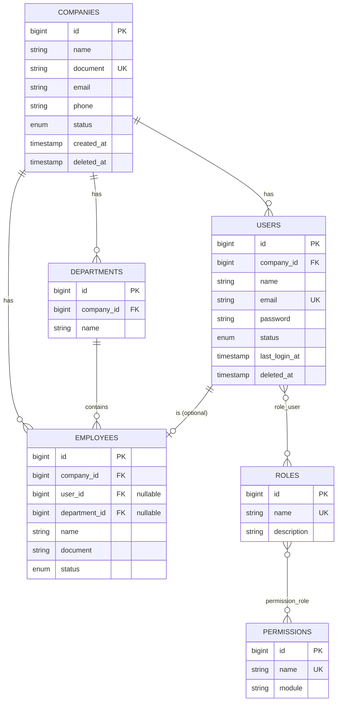
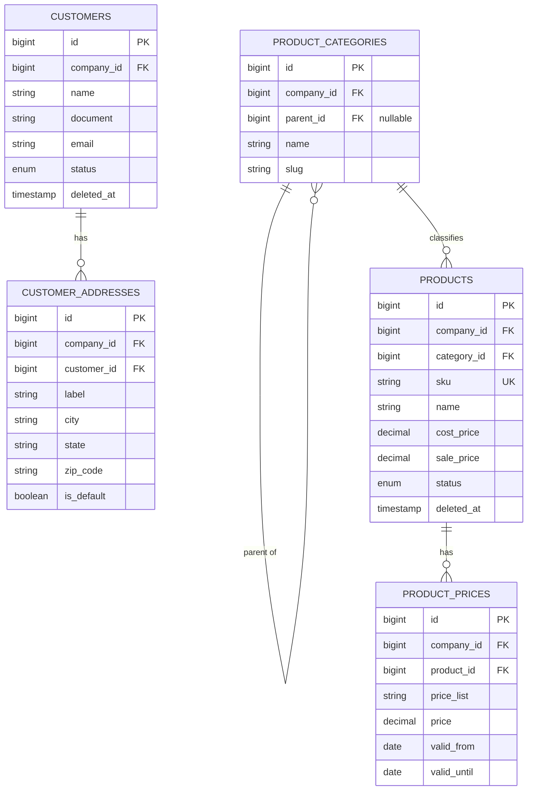
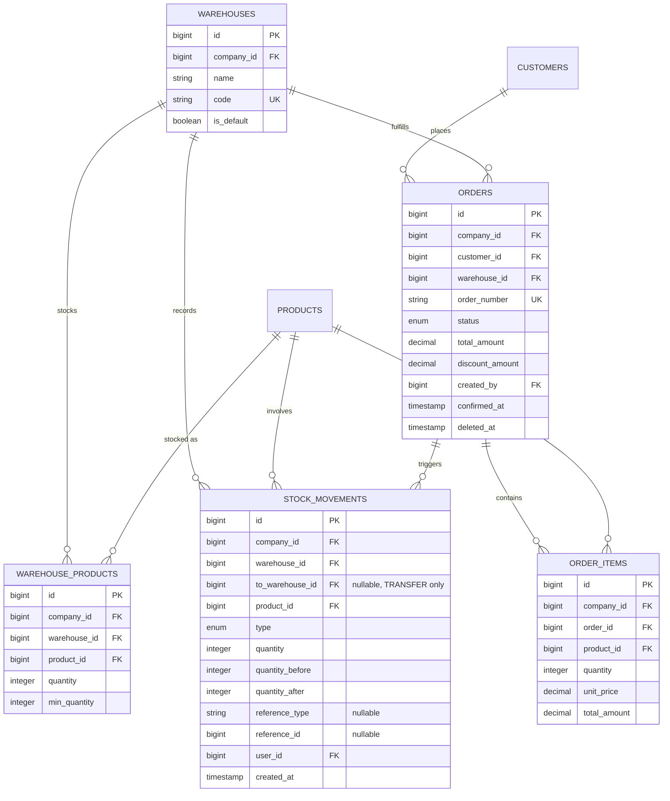
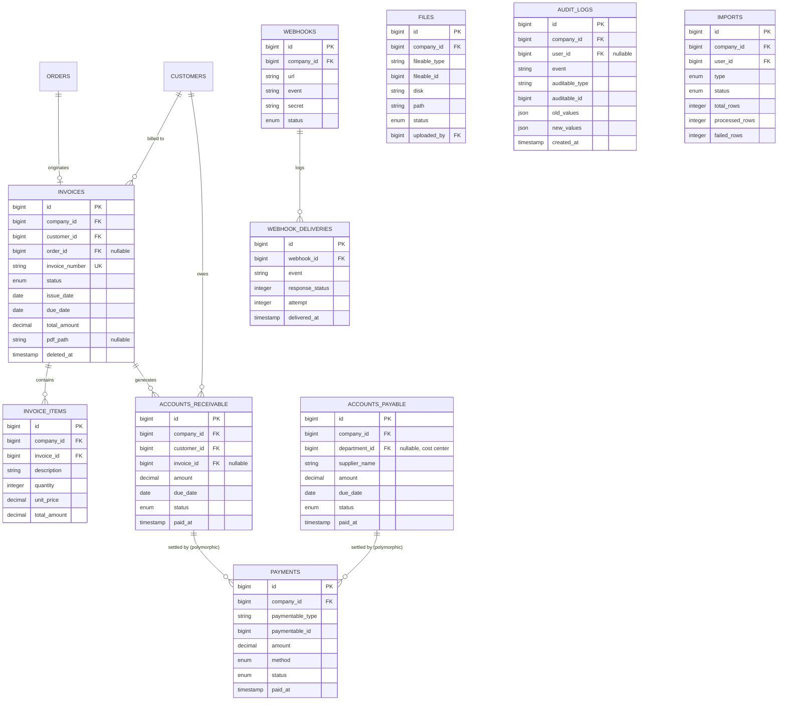

# Database Design

This document is the single source of truth for the EnterpriseHub schema. It
precedes any Eloquent model or migration — the code in later phases must match
what is described here, and this file is updated whenever the schema changes.

Every table below (except a handful of Laravel framework defaults, noted at
the end) carries a `company_id` foreign key and participates in the
multi-tenancy strategy described in [architecture.md](architecture.md#8-multi-tenancy-strategy).

## Table of contents

- [1. Entity-relationship diagrams](#1-entity-relationship-diagrams)
- [2. Table reference](#2-table-reference)
- [3. Enums](#3-enums)
- [4. Indexes](#4-indexes)
- [5. Known risk areas](#5-known-risk-areas)
- [6. Framework-provided tables](#6-framework-provided-tables)

---

## 1. Entity-relationship diagrams

A single diagram with 30+ tables is unreadable, so the schema is split into
four domain diagrams. Every table in every diagram also has an implicit
`belongs to Company` relationship (omitted from the drawings to avoid
redundant crossing lines) — see [multi-tenancy strategy](architecture.md#8-multi-tenancy-strategy).

### 1.1 Tenancy & Access

### 1.2 CRM & Catalog

### 1.3 Stock & Sales

### 1.4 Finance & Support

> **Note on `payments`**: modeled as polymorphic (`paymentable_type` /
> `paymentable_id`, pointing at `AccountsReceivable` or `AccountsPayable`)
> rather than a direct FK to either table. A payment always settles a debt —
> whether the company owes money (payable) or is owed money (receivable) —
> and both cases share the exact same fields (amount, method, status,
> paid_at). Two near-identical tables (`receivable_payments`,
> `payable_payments`) would duplicate the schema and the `ProcessPaymentService`
> logic for no real benefit. `Invoice.status` is not written to directly by a
> payment — it is recomputed by an Observer/Listener when all of its
> `accounts_receivable` rows reach `PAID`, keeping one source of truth for
> "is this invoice settled."

---

## 2. Table reference

Only non-obvious columns are annotated; `id`, `created_at`, `updated_at` are
omitted from the "notes" column when they need no explanation.

### companies

| Column | Type | Null | Notes |
|---|---|---|---|
| name | string | no | |
| document | string(20) | no | CNPJ; unique |
| email | string | no | |
| phone | string(20) | yes | |
| status | enum `CompanyStatus` | no | default `active` |
| settings | json | yes | company-level config (see [§ Settings](architecture.md#settings-storage)); avoids a separate key-value table |
| deleted_at | timestamp | yes | soft delete |

### users

| Column | Type | Null | Notes |
|---|---|---|---|
| company_id | FK → companies | no | |
| name | string | no | |
| email | string | no | **globally** unique — see [multi-tenancy strategy](architecture.md#8-multi-tenancy-strategy) for why this is not scoped per company |
| password | string | no | hashed (bcrypt) |
| status | enum `UserStatus` | no | default `active` |
| last_login_at | timestamp | yes | |
| email_verified_at | timestamp | yes | |
| deleted_at | timestamp | yes | |

### roles / permissions / role_user / permission_role

Global catalogs, not per-company (see [RBAC decision](architecture.md#rbac-global-vs-per-company)).

| Table | Columns | Notes |
|---|---|---|
| roles | `id`, `name` (unique), `description` | seeded: ADMIN, MANAGER, FINANCE, SALES, STOCK, EMPLOYEE |
| permissions | `id`, `name` (unique), `module` | dot-notation, e.g. `orders.confirm` |
| role_user | `role_id` FK, `user_id` FK | composite PK |
| permission_role | `permission_id` FK, `role_id` FK | composite PK |

### departments

| Column | Type | Null | Notes |
|---|---|---|---|
| company_id | FK → companies | no | |
| name | string | no | |
| description | string | yes | |
| deleted_at | timestamp | yes | |

### employees

| Column | Type | Null | Notes |
|---|---|---|---|
| company_id | FK → companies | no | |
| user_id | FK → users | yes | set only if the employee has system access |
| department_id | FK → departments | yes | |
| name | string | no | |
| document | string(20) | no | CPF |
| position | string | yes | job title |
| status | enum `EmployeeStatus` | no | |
| hired_at | date | yes | |
| deleted_at | timestamp | yes | |

### customers

| Column | Type | Null | Notes |
|---|---|---|---|
| company_id | FK → companies | no | |
| name | string | no | |
| document | string(20) | yes | CPF/CNPJ |
| email | string | yes | |
| phone | string(20) | yes | |
| status | enum `CustomerStatus` | no | |
| deleted_at | timestamp | yes | |

### customer_addresses

| Column | Type | Null | Notes |
|---|---|---|---|
| company_id | FK → companies | no | denormalized from `customer_id` — see [company_id-on-every-table](architecture.md#8-multi-tenancy-strategy) |
| customer_id | FK → customers | no | |
| label | string | no | `billing`, `shipping`, `home`, ... |
| street, number, complement, neighborhood, city, state, zip_code, country | string | mixed | |
| is_default | boolean | no | default `false` |

### product_categories

| Column | Type | Null | Notes |
|---|---|---|---|
| company_id | FK → companies | no | |
| parent_id | FK → product_categories | yes | self-referencing, one level of nesting used in practice |
| name | string | no | |
| slug | string | no | unique per company |
| deleted_at | timestamp | yes | |

### products

| Column | Type | Null | Notes |
|---|---|---|---|
| company_id | FK → companies | no | |
| category_id | FK → product_categories | no | |
| sku | string(64) | no | unique per company |
| name | string | no | |
| description | text | yes | |
| cost_price | decimal(12,2) | no | |
| sale_price | decimal(12,2) | no | current effective price, cached for fast reads |
| status | enum `ProductStatus` | no | |
| deleted_at | timestamp | yes | |

### product_prices

| Column | Type | Null | Notes |
|---|---|---|---|
| company_id | FK → companies | no | |
| product_id | FK → products | no | |
| price_list | string | no | e.g. `retail`, `wholesale` |
| price | decimal(12,2) | no | |
| valid_from / valid_until | date | yes | |

Historical/multi-list price table, independent of `products.sale_price`
(the cached "current" price) — see [architecture.md](architecture.md#products-vs-product_prices).

### warehouses

| Column | Type | Null | Notes |
|---|---|---|---|
| company_id | FK → companies | no | |
| name | string | no | |
| code | string(20) | no | unique per company |
| is_default | boolean | no | |
| status | enum `WarehouseStatus` | no | |
| deleted_at | timestamp | yes | |

### warehouse_products

| Column | Type | Null | Notes |
|---|---|---|---|
| company_id | FK → companies | no | |
| warehouse_id | FK → warehouses | no | |
| product_id | FK → products | no | unique with warehouse_id |
| quantity | integer | no | cached current balance, **only** ever changed inside the transaction that inserts a `stock_movements` row |
| min_quantity | integer | no | reorder threshold, drives `LowStockNotification` |

### stock_movements

| Column | Type | Null | Notes |
|---|---|---|---|
| company_id | FK → companies | no | |
| warehouse_id | FK → warehouses | no | source warehouse |
| to_warehouse_id | FK → warehouses | yes | destination warehouse, set only when `type = TRANSFER` |
| product_id | FK → products | no | |
| type | enum `StockMovementType` | no | ENTRY / EXIT / RETURN / ADJUSTMENT / TRANSFER |
| quantity | integer | no | always positive; `type` gives direction |
| quantity_before / quantity_after | integer | no | snapshot of `warehouse_products.quantity`, makes the ledger self-auditing without replaying history |
| reference_type / reference_id | polymorphic | yes | e.g. points back at the `Order` that caused an `EXIT` |
| user_id | FK → users | no | who triggered it |
| created_at | timestamp | no | append-only, no `updated_at` |

### orders

| Column | Type | Null | Notes |
|---|---|---|---|
| company_id | FK → companies | no | |
| customer_id | FK → customers | no | |
| warehouse_id | FK → warehouses | no | fulfillment warehouse |
| order_number | string | no | unique per company, human-readable |
| status | enum `OrderStatus` | no | DRAFT → PENDING → CONFIRMED → PROCESSING → SHIPPED → DELIVERED, or → CANCELLED |
| total_amount / discount_amount | decimal(12,2) | no | |
| notes | text | yes | |
| created_by | FK → users | no | |
| confirmed_at / shipped_at / delivered_at / cancelled_at | timestamp | yes | |
| deleted_at | timestamp | yes | |

### order_items

| Column | Type | Null | Notes |
|---|---|---|---|
| company_id | FK → companies | no | |
| order_id | FK → orders | no | |
| product_id | FK → products | no | |
| quantity | integer | no | |
| unit_price / discount_amount / total_amount | decimal(12,2) | no | price snapshotted at order time, independent of later `products.sale_price` changes |

### invoices

| Column | Type | Null | Notes |
|---|---|---|---|
| company_id | FK → companies | no | |
| customer_id | FK → customers | no | |
| order_id | FK → orders | yes | invoice can exist without an order (e.g. manual/service billing) |
| invoice_number | string | no | unique per company |
| status | enum `InvoiceStatus` | no | DRAFT / ISSUED / PAID / OVERDUE / CANCELLED — derived, see note above |
| issue_date / due_date | date | no | |
| total_amount | decimal(12,2) | no | |
| pdf_path | string | yes | populated asynchronously by `GenerateInvoicePdf` job |
| deleted_at | timestamp | yes | |

### invoice_items

| Column | Type | Null | Notes |
|---|---|---|---|
| company_id | FK → companies | no | |
| invoice_id | FK → invoices | no | |
| description | string | no | free text — an invoice line does not have to map 1:1 to a product |
| quantity / unit_price / total_amount | decimal | no | |

### accounts_receivable

| Column | Type | Null | Notes |
|---|---|---|---|
| company_id | FK → companies | no | |
| customer_id | FK → customers | no | |
| invoice_id | FK → invoices | yes | usually set; nullable to allow receivables not tied to a formal invoice |
| amount | decimal(12,2) | no | |
| due_date | date | no | |
| status | enum `ReceivableStatus` | no | PENDING / PAID / OVERDUE / CANCELLED |
| paid_at | timestamp | yes | |
| deleted_at | timestamp | yes | |

### accounts_payable

| Column | Type | Null | Notes |
|---|---|---|---|
| company_id | FK → companies | no | |
| department_id | FK → departments | yes | optional cost center |
| supplier_name | string | no | **simplification**: no dedicated `suppliers` table — not requested in scope, flagged here rather than silently invented |
| description | string | no | |
| amount | decimal(12,2) | no | |
| due_date | date | no | |
| status | enum `PayableStatus` | no | |
| paid_at | timestamp | yes | |
| deleted_at | timestamp | yes | |

### payments

| Column | Type | Null | Notes |
|---|---|---|---|
| company_id | FK → companies | no | |
| paymentable_type / paymentable_id | polymorphic | no | `AccountsReceivable` or `AccountsPayable` |
| amount | decimal(12,2) | no | |
| method | enum `PaymentMethod` | no | CASH / CREDIT_CARD / BANK_TRANSFER / PIX / BOLETO |
| status | enum `PaymentStatus` | no | PENDING / CONFIRMED / CANCELLED |
| paid_at | timestamp | yes | |

### files

| Column | Type | Null | Notes |
|---|---|---|---|
| company_id | FK → companies | no | |
| fileable_type / fileable_id | polymorphic | no | Customer, Order, Invoice, Employee, Product |
| disk | string | no | `local` in dev, `s3` in staging/prod |
| path | string | no | |
| original_name / mime_type / size | string/int | no | |
| status | enum `FileStatus` | no | PENDING / PROCESSED / FAILED — async processing for large files |
| uploaded_by | FK → users | no | |
| deleted_at | timestamp | yes | |

### audit_logs

| Column | Type | Null | Notes |
|---|---|---|---|
| company_id | FK → companies | no | |
| user_id | FK → users | yes | null for system/console-triggered changes |
| event | string | no | `created`, `updated`, `deleted` |
| auditable_type / auditable_id | polymorphic | no | |
| old_values / new_values | json | yes | |
| ip_address | string(45) | yes | |
| user_agent | string | yes | |
| created_at | timestamp | no | immutable — no `updated_at`, no soft delete |

### imports

| Column | Type | Null | Notes |
|---|---|---|---|
| company_id | FK → companies | no | |
| user_id | FK → users | no | who triggered it |
| type | enum `ImportType` | no | CUSTOMERS / PRODUCTS / ... |
| status | enum `ImportStatus` | no | PENDING / PROCESSING / COMPLETED / FAILED |
| file_path | string | no | |
| total_rows / processed_rows / failed_rows | integer | no | default 0 |
| errors | json | yes | per-row validation failures |
| started_at / finished_at | timestamp | yes | |

### webhooks

| Column | Type | Null | Notes |
|---|---|---|---|
| company_id | FK → companies | no | |
| url | string | no | |
| event | string | no | e.g. `order.created` |
| secret | string | no | HMAC signing secret, encrypted at rest |
| status | enum `WebhookStatus` | no | ACTIVE / INACTIVE |
| deleted_at | timestamp | yes | |

### webhook_deliveries — *suggested addition, flagged*

Not explicitly requested; the brief only says "implement retry" for
webhooks. Retry needs *something* to know what was already attempted and
with what result, so a minimal delivery log is proposed rather than
invented silently:

| Column | Type | Null | Notes |
|---|---|---|---|
| webhook_id | FK → webhooks | no | |
| event | string | no | |
| payload | json | no | |
| response_status | integer | yes | HTTP status returned, null if the request never completed |
| attempt | integer | no | |
| delivered_at | timestamp | yes | |

---

## 3. Enums

All represent closed sets of states and are implemented as PHP 8.1+ backed
enums (`Enum: string`), never magic strings (rule from the brief, §40).

| Enum | Values |
|---|---|
| `CompanyStatus` | active, inactive, suspended |
| `UserStatus` | active, inactive, suspended |
| `EmployeeStatus` | active, inactive, on_leave, terminated |
| `CustomerStatus` | active, inactive |
| `ProductStatus` | active, inactive, discontinued |
| `WarehouseStatus` | active, inactive |
| `StockMovementType` | ENTRY, EXIT, RETURN, ADJUSTMENT, TRANSFER |
| `OrderStatus` | DRAFT, PENDING, CONFIRMED, PROCESSING, SHIPPED, DELIVERED, CANCELLED |
| `InvoiceStatus` | DRAFT, ISSUED, PAID, OVERDUE, CANCELLED |
| `ReceivableStatus` | PENDING, PAID, OVERDUE, CANCELLED |
| `PayableStatus` | PENDING, PAID, OVERDUE, CANCELLED |
| `PaymentMethod` | CASH, CREDIT_CARD, BANK_TRANSFER, PIX, BOLETO |
| `PaymentStatus` | PENDING, CONFIRMED, CANCELLED |
| `FileStatus` | PENDING, PROCESSED, FAILED |
| `ImportType` | CUSTOMERS, PRODUCTS |
| `ImportStatus` | PENDING, PROCESSING, COMPLETED, FAILED |
| `WebhookStatus` | ACTIVE, INACTIVE |

`OrderStatus` and `InvoiceStatus`/`ReceivableStatus` additionally expose a
`canTransitionTo(self $target): bool` method so illegal transitions
(e.g. `DELIVERED → PENDING`, `CANCELLED → CONFIRMED`) are rejected in one
place instead of scattered `if` checks across controllers/services.

---

## 4. Indexes

Every index below is justified by a concrete query it serves — no index is
added "just in case."

| Table | Columns | Reason | Query benefited |
|---|---|---|---|
| every tenant table | `company_id` | multi-tenancy filters every single query by this column | the `CompanyScope` global scope, applied on every read |
| `users` | `email` (unique) | login lookup, uniqueness | `Auth::attempt()` |
| `users` | `company_id, status` (composite) | admin user listing filtered by status | `GET /users?status=active` |
| `products` | `company_id, sku` (unique composite) | SKU must be unique per company, and is the primary lookup key at checkout/import | product search by SKU |
| `products` | `company_id, status` (composite) | catalog listing excludes discontinued items by default | product listing/search |
| `customers` | `company_id, document` | duplicate-customer detection on create/import | `CreateCustomerService` |
| `orders` | `company_id, status` (composite) | order queues/boards filtered by status (e.g. "all PENDING orders") | Sales dashboard |
| `orders` | `company_id, order_number` (unique composite) | human-readable order lookup, must be unique per company | order detail page, invoice generation |
| `orders` | `customer_id` | customer order history | `Customer::orders` relation |
| `stock_movements` | `warehouse_id, product_id, created_at` (composite) | rebuilding/auditing a product's stock history in a warehouse in chronological order | stock report, movement audit |
| `invoices` | `company_id, status, due_date` (composite) | overdue-invoice scan run by the scheduler | `invoices:check-overdue` command |
| `accounts_receivable` | `company_id, status, due_date` (composite) | same as above, at the receivable level | payment reminder job |
| `accounts_payable` | `company_id, status, due_date` (composite) | payable due-date scan | financial dashboard |
| `payments` | `paymentable_type, paymentable_id` (composite) | resolving all payments for a given receivable/payable | `MorphMany` relation |
| `audit_logs` | `company_id, auditable_type, auditable_id` (composite) | "show history for this record" | audit trail on any entity's detail page |
| `audit_logs` | `created_at` | log retention/cleanup, chronological browsing | `system:health`, cleanup command |
| all `*_id` foreign keys | single-column | referential integrity + join performance | every relationship |

`company_id` is placed **first** in every composite index above (except
where the leading column is already a natural unique key like
`paymentable_type`) so a single index also serves plain
`WHERE company_id = ?` queries — MySQL can use a left-prefix of a composite
index.

---

## 5. Known risk areas

Called out now, before a single query is written, so later phases can be
checked against this list rather than discovering the problem in production.

| Risk | Where | Mitigation |
|---|---|---|
| N+1 on order listings | `Order::with('customer', 'items.product')` needed whenever orders are listed/paginated | enforced via API Resources + a `ResolveN1` habit: every index/list endpoint eager-loads its known relations, checked in Feature tests with `assertQueryCountLessThan` in the testing phase |
| N+1 on invoice PDF generation | `Invoice::with('items', 'customer', 'order')` | job loads once with eager loading before handing off to the PDF renderer |
| Race condition on stock quantity | two orders confirmed concurrently for the last unit of a product | `lockForUpdate()` on the `warehouse_products` row inside `DB::transaction()`, see [architecture.md § concurrency](architecture.md#concurrency-strategy) |
| Race condition on payment double-confirmation | same payment confirmed twice from two requests/webhooks | idempotent `ProcessPaymentService` — a payment already `CONFIRMED` short-circuits; queue jobs use `ShouldBeUnique` keyed by payment id |
| Duplicate customers on CSV import | large import with overlapping data | `company_id + document` index used for upsert-by-document during `ProcessCsvImport` |
| Unbounded `audit_logs`/`stock_movements` growth | both are append-only, grow forever | scheduler-driven archival/cleanup command (`system:health` reports table size; actual archival is out of scope for phase 1, flagged for later) |
| Incorrect relationship: `products.sale_price` vs `product_prices` | risk of two sources of truth diverging | documented ownership: `sale_price` is *cache*, `product_prices` is *history*; only the `UpdateProductPriceService` writes to both, in the same transaction |

---

## 6. Framework-provided tables

Standard Laravel migrations, not redesigned here — they ship with the
framework and are used as-is:

- `password_reset_tokens`, `sessions` — auth scaffolding
- `personal_access_tokens` — Sanctum API tokens
- `notifications` — database notification channel
- `jobs`, `job_batches`, `failed_jobs` — queue backend bookkeeping (used for
  introspection; the actual queue driver is Redis, see
  [architecture.md § queue architecture](architecture.md#17-queue-architecture))
- `cache`, `cache_locks` — only relevant if the database cache/lock driver is
  used as a fallback; Redis is the primary driver, see
  [architecture.md § cache architecture](architecture.md#19-cache-architecture)
